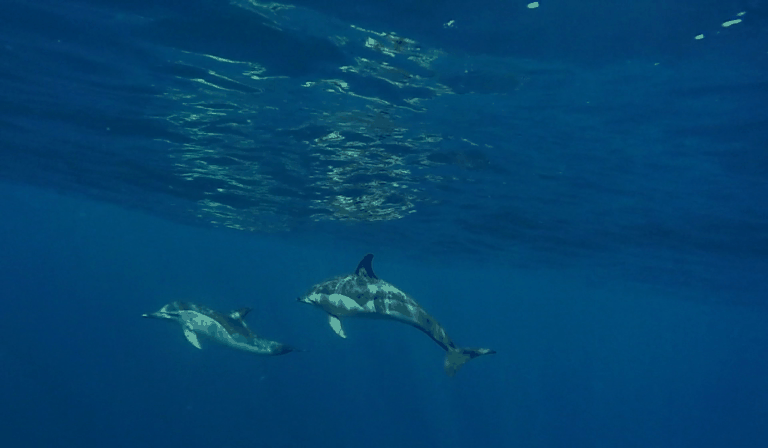
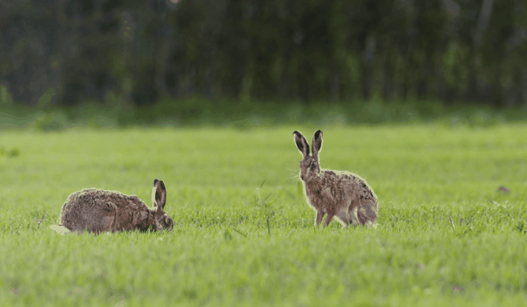
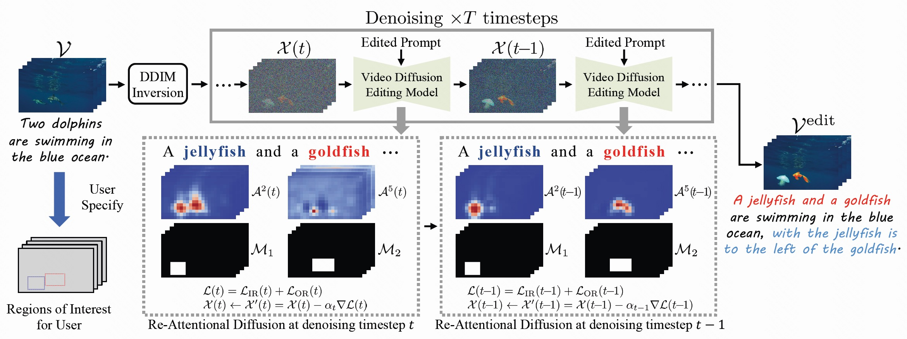

# ReAtCo

## Re-Attentional Controllable Video Diffusion Editing, AAAI 2025

 

This work proposes a new text-guided video editing framework focusing on controllable video generation and editing, with a particular emphasis on the controllability of the spatial location of multiple foreground objects.

## Video Demos

<table class="center">
  <td></td>
  <td></td>
  <td></td>
  <td></td>
  <tr>
  <td width=25% style="text-align:center;">[Source Video]: "Two dolphins are swimming in the blue ocean."</td>
  <td width=25% style="text-align:center;">"A jellyfish and a goldfish are swimming in the blue ocean, with the jellyfish is to the left of the goldfish."</td>
  <td width=25% style="text-align:center;">"A turtle and a goldfish are swimming in the blue ocean, with the turtle is to the left of the goldfish."</td>
  <td width=25% style="text-align:center;">"A jellyfish and a octopus are swimming in the blue ocean, with the jellyfish is to the left of the octopus."</td>
</tr>
</table >

<table class="center">
  <td></td>
  <td></td>
  <td></td>
  <td></td>
  <tr>
  <td width=25% style="text-align:center;">[Source Video]: "Two hares are grazing in the grass."</td>
  <td width=25% style="text-align:center;">"A swan and a hare are grazing in the grass, with the swan is to the left of the hare."</td>
  <td width=25% style="text-align:center;">"A cat and a swan are grazing in the grass, with the cat is to the left of the swan."</td>
  <td width=25% style="text-align:center;">"A cat and a swan are grazing in the yellow meadow, with the cat is to the left of the swan."</td>
</tr>
</table >

## Overview Framework of ReAtCo
The main idea of ReAtCo is to refocus the cross-attention activation responses between the edited text prompt and the target video during the denoising stage, resulting in a spatially location-aligned and semantically high-fidelity manipulated video. More details could be found in our [paper](http://arxiv.org/abs/2412.11710).

## Usage
We now introduce how to run our codes and edit the controllable and desired target videos.

### Requirements

We use the classic Tune-A-Video as the pretrained base video editing model, so that the Requirements could follow [Tune-A-Video's publicly available codes](https://github.com/showlab/Tune-A-Video).
Note that 
